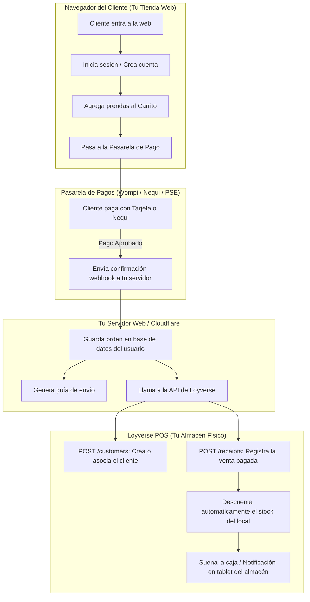

# Guía Completa de la API de Loyverse: Capacidades, Limitaciones y Arquitectura para Tienda Online

Este documento detalla **todo lo que se puede y no se puede hacer** con la API oficial de Loyverse POS, y explica la **arquitectura recomendada** para crear una tienda online completa con cuentas de usuario, carrito de compras y pasarela de pagos integrada a tu inventario físico.

---

## 1. Mapa Completo de la API de Loyverse: ¿Qué PUEDES hacer?

La API de Loyverse es de tipo **RESTful (JSON)** y te da control programático sobre las siguientes áreas de tu negocio:

### A. Inventario y Existencias (`/inventory`)
* ✅ **Consultar stock en tiempo real:** Ver cuántas unidades quedan por talla, color y sucursal.
* ✅ **Ajuste masivo de inventario:** Modificar el stock de cualquier prenda programáticamente (fijar en 0, sumar entradas de taller o corregir conteos como hicimos hoy).

### B. Productos y Prendas (`/items`, `/variants`)
* ✅ **Crear, editar y eliminar prendas:** Título, descripción, precio base, categoría y código de barras.
* ✅ **Gestionar variantes:** Crear o modificar tallas (S, M, L, XL) y colores (Negro, Gris, Marfil).
* ✅ **Subir y eliminar fotos:** Cargar imágenes directamente a los servidores de Loyverse (`POST /items/{item_id}/image`).

### C. Ventas y Recibos (`/receipts`)
* ✅ **Registrar ventas externas:** Cuando alguien compre en tu página web, puedes enviar la orden por API para que se cree un recibo oficial en Loyverse.
* ✅ **Descuento automático de stock:** Al registrar la venta por API, Loyverse descuenta las unidades vendidas en la tienda física inmediatamente.
* ✅ **Consultar historial de ventas:** Ver reportes de ventas pasadas, métodos de pago utilizados y montos.
* ✅ **Hacer reembolsos o devoluciones:** Marcar órdenes devueltas para reintegrar el stock.

### D. Clientes y CRM (`/customers`)
* ✅ **Crear y editar clientes:** Nombre, teléfono, correo electrónico, dirección y notas.
* ✅ **Historial de compra:** Consultar qué prendas ha comprado un cliente específico.
* ✅ **Puntos de lealtad:** Ver saldo de puntos acumulados.

### E. Descuentos y Cupones (`/discounts`)
* ✅ **Crear y consultar promociones:** Descuentos porcentuales (ej. 10%) o valores fijos (ej. $10.000).

### F. Categorías y Modificadores (`/categories`, `/modifiers`)
* ✅ **Organizar catálogo:** Crear o renombrar categorías (Acidwash, Oversize, etc.) y modificadores (precios por mayor).

### G. Webhooks en Tiempo Real (`/webhooks`)
* ✅ **Notificaciones automáticas:** Loyverse puede enviar una alerta instantánea a tu servidor cada vez que:
  * Se vende una prenda en la caja física.
  * Cambia el stock de un producto.
  * Se crea o edita un producto en el Back Office.

---

## 2. ¿Qué NO PUEDE hacer la API de Loyverse? (Limitaciones)

Loyverse es un **sistema de Punto de Venta (POS)**, **no es un motor de tienda e-commerce**. Por lo tanto, carece de las siguientes funciones que deben residir en tu propia aplicación web:

| Función | ¿Lo tiene Loyverse API? | ¿Dónde se resuelve? |
| :--- | :---: | :--- |
| **Cuentas de usuario con contraseña / Login** | ❌ **NO** | En la base de datos de tu tienda web (ej. Supabase, Firebase o PostgreSQL) con autenticación segura (JWT / Google Login). |
| **Sesión de Carrito de Compras** | ❌ **NO** | En el navegador del cliente (LocalStorage / Cookies) o en el backend de tu tienda web. |
| **Pasarela de Pago (Cobro con Tarjetas / Nequi / PSE)** | ❌ **NO** | Mediante una pasarela certificada (ej. **Wompi Bancolombia**, **Mercado Pago**, **Bold** o **PayU**). |
| **Cotización de Envíos y Guías** | ❌ **NO** | Con APIs de transportadoras (Interrapidísimo, Coordinadora, Envia, 99Minutos). |
| **Retención de Stock Temporal (Apartado en carrito)** | ❌ **NO** | Loyverse solo descuenta stock cuando se confirma la venta; no tiene función de "apartar por 15 minutos mientras paga". |

---

## 3. ¿Es viable crear una tienda online con Loyverse?

**SÍ, es 100% viable y es el estándar que usan las grandes marcas de ropa.**

No necesitas que Loyverse haga todo; Loyverse actúa como el **"Cerebro de Inventario y Ventas"**, mientras que tu página web se encarga de la **"Experiencia del Cliente y el Pago"**.

---

## 4. Los 4 Bloques Necesarios para tu Tienda Online Completa

Si decides construir la tienda web completa con login y pagos, estos son los 4 componentes:

### Bloque 1: Frontend (Lo que ve el cliente)
* Catálogo interactivo (como el actual, pero con vista detallada).
* Carrito de compras flotante con persistencia (si cierra la página, sus prendas siguen ahí).
* Panel de cliente: *"Mis pedidos"*, *"Mis direcciones de envío"*, *"Editar perfil"*.

### Bloque 2: Autenticación de Usuarios
* Sistema de registro con Correo + Contraseña o *"Continuar con Google"*.
* Guardado seguro de contraseñas encriptadas (bcrypt/Argon2).
* Herramientas recomendadas para desarrollo ágil y sin costo inicial: **Supabase Auth** o **Firebase Auth**.

### Bloque 3: Pasarela de Pagos en Colombia
* **Wompi (de Bancolombia):** Ideal para Colombia (Nequi directo con push al celular, botón Bancolombia, PSE, Tarjetas de Crédito/Débito).
* **Mercado Pago:** Muy conocida y confiable para clientes finales.
* **Bold:** Excelente integración y tarifas competitivas.

### Bloque 4: El Conector con Loyverse (Backend Serverless)
Cuando la pasarela confirme el pago:
1. Tu servidor ejecuta `POST /v1.0/customers` para registrar al comprador en Loyverse si es nuevo.
2. Ejecuta `POST /v1.0/receipts` con los IDs de las prendas compradas, el valor total y el método de pago (ej. `WOMPI_ONLINE`).
3. En la tablet de tu tienda física en el centro, el inventario se reduce al instante y el equipo de despacho ve la orden lista para empacar.

---

## 5. Resumen Ejecutivo

| ¿Qué quieres lograr? | ¿Se puede con Loyverse? | Cómo se resuelve |
| :--- | :---: | :--- |
| **Tener catálogo actualizado en tiempo real** | ✅ **SÍ** | Con la API que ya tienes conectada (`/api/catalog`). |
| **Modificar inventario desde código/comandos** | ✅ **SÍ** | Vía `POST /inventory` (lo que hicimos hoy para limpiar los negativos). |
| **Crear cuenta de cliente con login/clave** | ⚠️ **PARCIAL** | La web gestiona la clave y guarda el perfil en Loyverse (`/customers`). |
| **Cobrar con Nequi, PSE o Tarjetas** | ⚠️ **EXTERNO** | Se conecta Wompi o Mercado Pago en la web; una vez pagado, se reporta la venta a Loyverse (`/receipts`). |
| **Sincronización bidireccional física + online** | ✅ **SÍ** | Si se vende en el local, baja en la web. Si se vende en la web, baja en el local. |
